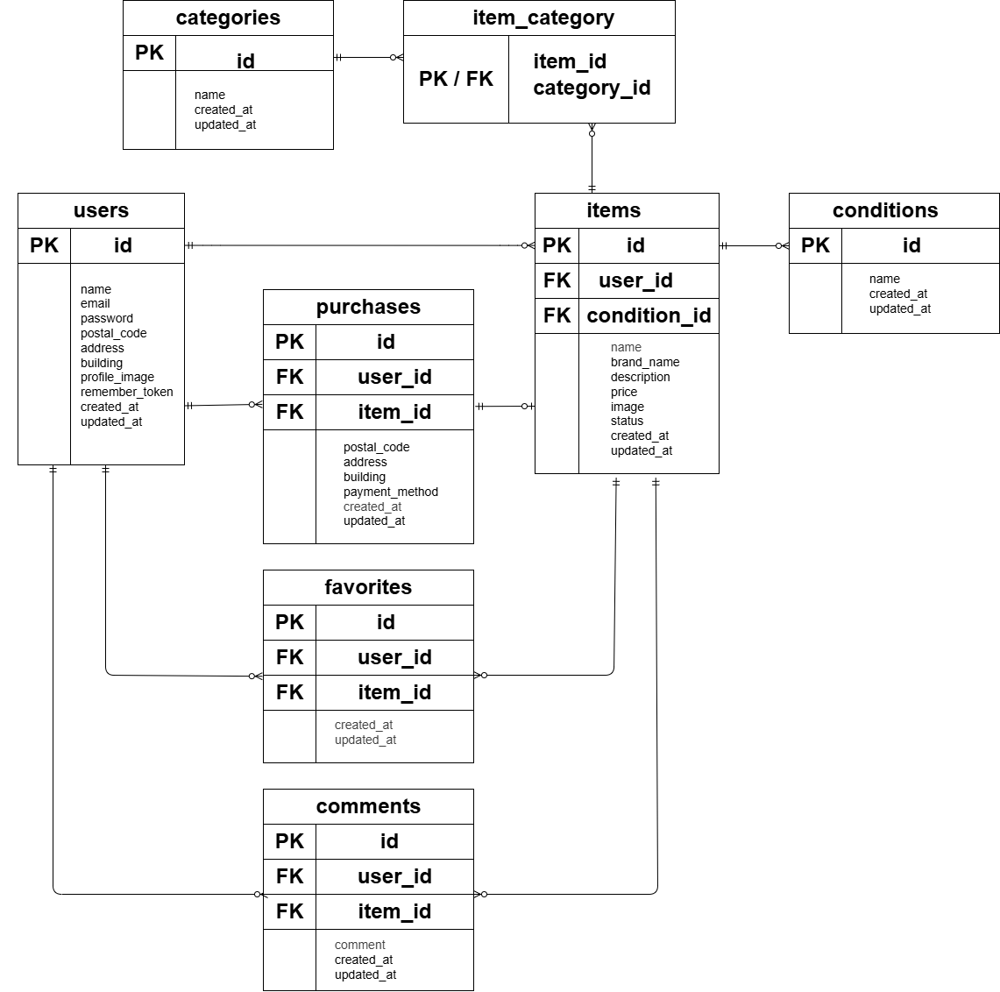

# アプリケーション名

Flea Market App

Laravelを使用して開発したフリマアプリケーションです。
ユーザー登録・ログイン、商品出品、商品検索、お気に入り、コメント、プロフィール編集、購入、Stripeによる決済などの機能を実装しています。

## 概要

ユーザー同士で商品の出品・購入ができるフリマアプリです。

商品一覧から商品を検索・閲覧し、気になる商品をお気に入り登録できます。
また、商品詳細画面からコメントを投稿したり、購入時に配送先や支払い方法を指定して商品を購入できます。

## 使用技術(実行環境)

### バックエンド

- PHP 8.1.34
- Laravel 8.83.29
- Laravel Fortify
- PHPUnit

### フロントエンド

- HTML
- CSS
- JavaScript
- Blade

### データベース

- MySQL 8.0.26

### 開発環境

- Docker
- Docker Compose
- Nginx
- phpMyAdmin

### 外部サービス

- Stripe Checkout

## 実装機能

### 認証

- ユーザー登録
- ログイン
- ログアウト
- バリデーション

### 商品

- 商品一覧表示
- 商品詳細表示
- 商品検索
- 商品出品
- 商品画像登録
- 商品カテゴリ登録
- 商品状態表示
- 売却済み商品の表示

### お気に入り

- 商品のお気に入り登録
- お気に入り解除
- お気に入り登録状態の表示
- マイリスト表示

### コメント

- 商品へのコメント投稿
- コメントのバリデーション
- 未ログインユーザーのコメント投稿制限

### プロフィール

- プロフィール表示
- プロフィール編集
- プロフィール画像設定
- 郵便番号・住所・建物名の登録

### 購入

- 商品購入
- 購入商品の表示
- 配送先変更
- 支払い方法選択
- 購入完了後の商品売却済みへの変更

### 決済

Stripe Checkoutを利用したオンライン決済を実装しています。

- クレジットカード決済
- コンビニ決済
- Stripe Checkoutへのリダイレクト
- 決済完了後の購入処理

## ER図



## データベース構成

以下のテーブルを使用しています。

| テーブル      | 概要                         |
| ------------- | ---------------------------- |
| users         | ユーザー情報                 |
| items         | 商品情報                     |
| purchases     | 購入情報                     |
| favorites     | お気に入り情報               |
| comments      | コメント情報                 |
| categories    | カテゴリ情報                 |
| conditions    | 商品状態                     |
| item_category | 商品とカテゴリの中間テーブル |

`item_category` テーブルでは、`item_id` と `category_id` による複合主キーを使用しています。

## 環境構築

### 1. リポジトリをクローン

```bash
git clone https://github.com/Ayumi1809/flea-market-app.git
cd flea-market-app
```

### 2. Dockerコンテナを起動

```bash
docker-compose up -d
```

### 3. PHPコンテナへ移動

```bash
docker-compose exec php bash
```

### 4. Composerパッケージをインストール

```bash
composer install
```

### 5. `.env` を設定

`.env.example` をコピーして `.env` を作成します。

```bash
cp .env.example .env
```

データベース設定例：

```env
DB_CONNECTION=mysql
DB_HOST=mysql
DB_PORT=3306
DB_DATABASE=laravel_db
DB_USERNAME=laravel_user
DB_PASSWORD=laravel_pass
```

### 6. アプリケーションキーを生成

```bash
php artisan key:generate
```

### 7. マイグレーションを実行

```bash
php artisan migrate
```

### 8. 初期データを登録

Seederを実行して、商品・カテゴリ・ユーザーなどの初期データを登録します。

```bash
php artisan db:seed
```

※初期データがすでに登録されている場合は、重複エラーが発生する可能性があります。

### 9. ストレージへのシンボリックリンクを作成

```bash
php artisan storage:link
```

## Stripe設定

Stripeを利用するため、`.env` にStripeのAPIキーを設定します。

```env
STRIPE_KEY=your_stripe_publishable_key
STRIPE_SECRET=your_stripe_secret_key
```

Stripeのテストモードで動作確認を行ってください。

## テスト

PHPUnitによるFeatureテスト・Unitテストを実装しています。

テストを実行する場合は、PHPコンテナ内で以下を実行します。

```bash
php artisan test
```

現在、以下のテストを含む**51テストがすべて成功**しています。

```text
Tests: 51 passed
```

主なテスト対象：

- ログイン
- ログアウト
- ユーザー登録
- 商品一覧
- 商品詳細
- 商品検索
- 商品出品
- お気に入り
- コメント
- プロフィール
- 購入
- 支払い方法
- Stripe Checkout

## テスト用データベース

テスト実行時は開発用データベースとは分離したテスト用データベースを使用します。

`.env.testing` の設定例：

```env
DB_CONNECTION=mysql
DB_HOST=mysql
DB_PORT=3306
DB_DATABASE=demo_test
DB_USERNAME=root
DB_PASSWORD=root
```

テスト用データベースを初回準備する場合：

```bash
php artisan migrate --env=testing
```

## ディレクトリ構成

```text
flea-market-app/
├── README.md
├── docker-compose.yml
├── docker/
├── docs/
│   ├── ER図.png
│   └── er.drawio
├── src/
│   ├── app/
│   │   ├── Http/
│   │   ├── Models/
│   │   └── Providers/
│   ├── database/
│   │   ├── factories/
│   │   ├── migrations/
│   │   └── seeders/
│   ├── public/
│   │   ├── css/
│   │   └── images/
│   ├── resources/
│   │   └── views/
│   ├── routes/
│   ├── tests/
│   │   ├── Feature/
│   │   └── Unit/
│   ├── composer.json
│   └── phpunit.xml
```

## セキュリティ・依存パッケージ

Composerの依存パッケージを確認し、Guzzleを以下のバージョンで使用しています。

```text
guzzlehttp/guzzle 7.15.2
```

また、Composerによるオートロードの確認を行っています。

```bash
composer validate
composer dump-autoload
```

## 開発環境へのアクセス

Dockerコンテナ起動後、ブラウザから以下にアクセスします。

```text
http://localhost
```

phpMyAdmin：

```text
http://localhost:8080
```

※ポート番号は `docker-compose.yml` の設定に応じて変更してください。

## 注意事項

- Stripeはテストモードで使用してください。
- `.env` はGitにコミットしないでください。
- Stripeの秘密鍵などの機密情報は公開しないでください。
- 初回起動時はマイグレーションが必要です。

## 作成者

木内 亜由美
